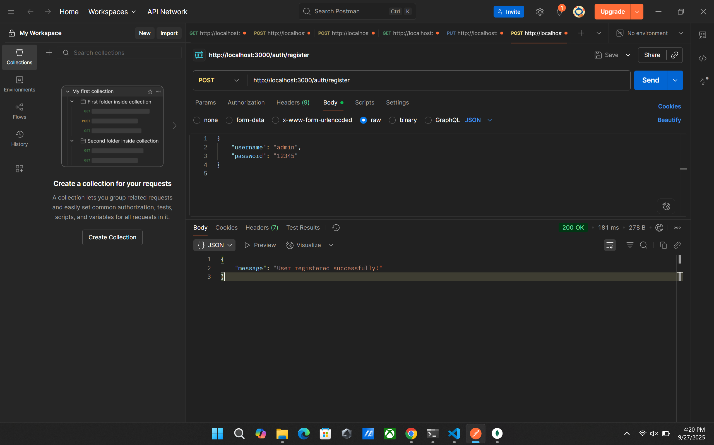

# Cookie Session Auth

## Giới thiệu
Dự án này là ví dụ về xác thực người dùng sử dụng session và cookie với MongoDB.

## Cách test API

1. **Đăng ký tài khoản**
   - Gửi POST request tới `/auth/register` với thông tin người dùng.
   - Nếu thành công, bạn sẽ nhận được thông báo đăng ký thành công.
   - 

2. **Đăng nhập**
   - Gửi POST request tới `/auth/login` với email và mật khẩu.
   - Nếu đăng nhập đúng, sẽ nhận được thông báo đăng nhập thành công và session được tạo.
   - 
   - Nếu sai thông tin, sẽ nhận được thông báo lỗi.
   - 

3. **Xem thông tin cá nhân**
   - Gửi GET request tới `/auth/profile` khi đã đăng nhập.
   - Nếu chưa đăng nhập, sẽ nhận được thông báo lỗi.
   - 
   - 
   - 

4. **Đăng xuất**
   - Gửi GET request tới `/auth/logout` để đăng xuất khỏi hệ thống.
   - 

## Hình ảnh minh họa

Các hình ảnh kết quả test API nằm trong thư mục `public/results`:
- register.png
- login_passed.png
- login_wrong.png
- profile.png
- session.png
- user.png
- logout.png

## Khởi chạy dự án

1. Cài đặt các package:
   ```bash
   npm install
   ```
2. Tạo file `.env` như hướng dẫn.
3. Chạy server:
   ```bash
   node app.js
   ```
4. Test các API bằng Postman hoặc công cụ tương tự.

## Liên hệ
Nếu có thắc mắc, vui lòng liên hệ qua email hoặc issue trên repo.
